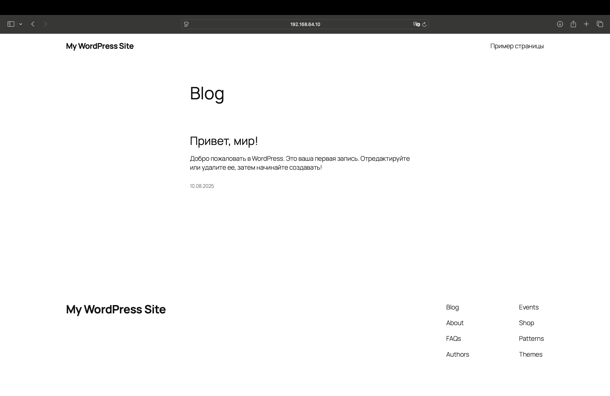

# Установка WordPress на Debian ARM64 в UTM

Этот документ описывает все шаги, которые я выполнил для развертывания WordPress с **разделенными** ролями на виртуальной машине Debian ARM64 с использованием UTM и Ansible.


## 1. Подготовка виртуальной машины

1. **Скачал образ Debian ARM64** с официального сайта.  
2. **Запустил виртуальную машину в UTM**:  
   - Выбрал архитектуру ARM64  
   - Настроил сеть (рекомендуется Shared Network для автоматического получения IP)  
   - Установил логин: debian, пароль: debian  
3. **Определил IP-адрес ВМ**:  
```bash
ip a
```
(192.168.64.10)


## 2. Настройка Ansible

1. **Создал рабочую папку**:
```bash
mkdir ~/wordpress_roles && cd ~/wordpress_roles
```
2. **Создал ansible.cfg**:
```cfg
[defaults]
inventory = ./inventory
```

3. **Создал inventory (указал IP виртуальной машины)**:
```
[myhosts]
192.168.64.10 ansible_user=debian ansible_ssh_private_key_file=~/.ssh/id_rsa
```

## 3. Подготовка Playbook и конфигов

1. **Создал playbook.yml (основной сценарий развертывания)**.
2. **Создал шаблоны конфигурации**:
* wordpress.conf.j2 (виртуальный хост Apache)
* wp-config.php.j2 (настройки WordPress)
3. **Проверил доступность сервера**:
```bash
ansible webservers -i inventory.ini -m ping
```

## 4. Разделил проект на роли:

1. **Роль: common**

* Установка базовых пакетов
* Настройка системного времени
* Обновление системы

2. **Роль: mysql**

* Установка MySQL Server
* Создание БД для WordPress
* Настройка пользователя БД
* Конфигурация безопасности

3. **Роль: apache**

* Установка Apache2
* Настройка виртуального хоста
* Включение необходимых модулей
* Управление сервисом

4. **Роль: php**

* Установка PHP и необходимых модулей
* Настройка PHP-FPM
* Оптимизация параметров php.ini

5. **Роль: wordpress**

* Загрузка и распаковка WordPress
* Настройка прав доступа
* Конфигурация wp-config.php
* Установка через WP-CLI

## 5. Запуск развертывания

1. **Выполнил playbook (с записью логов)**:
```bash
ansible-playbook playbook.yml -vvv > install.log 2>&1
```
2. **Проверил результат**:
* Открыл в браузере: http://192.168.64.10
* Страница WordPress:


## Итог
* #### WordPress успешно разделен на роли развернут на Debian ARM64 в UTM.
* #### Все настройки сохранены в Ansible-playbook для повторного использования.
* ##### Логи развертывания сохранены в install.log.